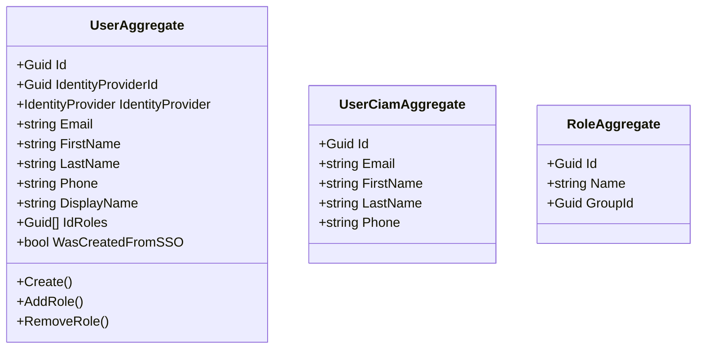
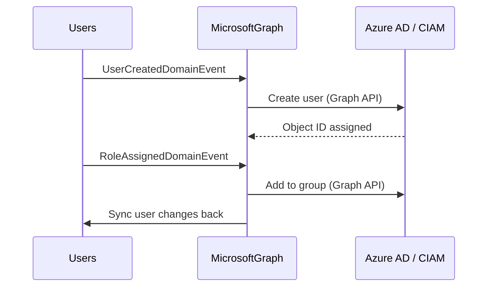

# MicrosoftGraph Microservice

## Overview

The MicrosoftGraph microservice manages the integration between the platform and Azure Active Directory / CIAM (Customer Identity and Access Management). It creates, updates, and deletes user accounts in the identity provider, manages group/role memberships in AD, and synchronizes identity provider state with the platform's Users microservice. It supports both Azure AD B2C and Azure AD B2B identity providers, handling the differences in user creation flows (password-based vs SSO).

## Business Context

A platform that uses Azure AD or Azure AD B2C as its identity provider needs a dedicated service to manage the lifecycle of user accounts in the external system. Creating a user in the platform requires creating a corresponding account in the identity provider so they can authenticate. Assigning a role requires adding the user to an AD group. Deleting a user requires removing their identity provider account.

The MicrosoftGraph microservice encapsulates all Microsoft Graph API interactions, isolating the rest of the platform from the complexity of OAuth2 admin consent flows, Graph API pagination, batch operations, and the differences between B2B and B2C user schemas. When the Users microservice needs to create a user, it emits an event; this service handles the actual AD account creation and reports back.

For a new developer: this is the "identity bridge" between the platform and Microsoft's cloud identity services. It ensures that every platform user has a corresponding account in Azure AD for authentication purposes.

## Ubiquitous Language

| Term               | Definition                                                                                                                          |
| ------------------ | ----------------------------------------------------------------------------------------------------------------------------------- |
| UserAggregate      | The local representation of a user in the identity provider context, tracking their identity provider ID, credentials, and roles.   |
| UserCiamAggregate  | A specialized user representation for CIAM (B2C) scenarios with different attribute mappings.                                        |
| RoleAggregate      | A local representation of an Azure AD group that corresponds to a platform role.                                                     |
| IdentityProvider   | The type of Azure AD instance: AzureAD (B2B) or AzureADB2C (CIAM). Determines user creation flow.                                  |
| IdentityProviderId | The object ID assigned to the user by Azure AD. Used to correlate platform users with their AD accounts.                             |
| WasCreatedFromSSO  | A flag indicating the user account was created via SSO federation rather than direct invitation, affecting password handling.         |
| IdRoles            | The list of AD group IDs the user is a member of, corresponding to platform roles.                                                   |
| Microsoft Graph API| The REST API provided by Microsoft for managing Azure AD resources (users, groups, applications).                                     |
| Group              | An Azure AD group that maps to a platform role. Users are added to/removed from groups for role management.                          |
| Password           | For non-SSO users, the initial password (encrypted) set during account creation. SSO users authenticate via their federated provider.|
| PasswordKey        | The encryption key identifier used to protect stored passwords.                                                                       |
| PasswordCipher     | The encrypted password value stored for non-SSO user creation.                                                                        |
| AddRole            | The operation that adds a user to an AD group (role membership).                                                                      |
| RemoveRole         | The operation that removes a user from an AD group.                                                                                   |
| Sync               | The process of ensuring consistency between platform user records and Azure AD user objects.                                           |
| DisplayName        | The user's display name as shown in Azure AD and platform UIs.                                                                        |

## Domain Model

The MicrosoftGraph domain has three aggregates. The `UserAggregate` tracks standard Azure AD users with their identity provider binding and role memberships. The `UserCiamAggregate` handles B2C-specific user flows. The `RoleAggregate` maps platform roles to AD groups.

## Data Dictionary

### UserAggregate

Tracks a user's identity provider binding and AD group memberships.

| Field              | Type             | Description                                                |
| ------------------ | ---------------- | ---------------------------------------------------------- |
| Id                 | Guid             | Platform user ID (matches Users microservice)              |
| IdentityProviderId | Guid             | Object ID in Azure AD                                      |
| IdentityProvider   | IdentityProvider | Provider type: AzureAD or AzureADB2C                      |
| Email              | string           | User's email address                                       |
| FirstName          | string           | Given name                                                 |
| LastName           | string           | Family name                                                |
| Phone              | string           | Contact phone number                                       |
| DisplayName        | string?          | Display name in AD                                         |
| IdRoles            | Guid[]           | AD group IDs the user belongs to                           |
| WasCreatedFromSSO  | bool             | Whether user was created via SSO federation                |
| IsActive           | bool             | Whether the AD account is active                           |

### Enumerations Reference

**IdentityProvider:** None, AzureAD, AzureADB2C

## Integration Architecture

MicrosoftGraph sits between the platform's Users microservice and Azure Active Directory. It consumes user lifecycle events from Users and synchronizes them to AD, and vice versa.

## Event Catalog

### Events Consumed

| Event                       | Source | Handler              | Action                                    |
| --------------------------- | ------ | -------------------- | ----------------------------------------- |
| `UserCreatedDomainEvent`    | Users  | `CreateUserHandler`  | Creates user account in Azure AD          |
| `RoleAssignedDomainEvent`   | Users  | `AddRoleHandler`     | Adds user to AD group                     |
| `RoleRemovedDomainEvent`    | Users  | `RemoveRoleHandler`  | Removes user from AD group                |
| `UserDeletedDomainEvent`    | Users  | `DeleteUserHandler`  | Disables/deletes AD account               |

### Events Produced

| Event                      | Trigger    | Purpose                                          |
| -------------------------- | ---------- | ------------------------------------------------ |
| `UserCreatedDomainEvent`   | `Create()` | Notifies that AD account was created with Object ID |

## API Reference

Base path: `/api`

### Users (AD Management)

| Method | Path                          | Description                              | Auth    |
| ------ | ----------------------------- | ---------------------------------------- | ------- |
| GET    | `/api/User`                   | List AD-managed users                    | Bearer  |
| GET    | `/api/User/{id}`              | Get an AD user by platform ID            | Bearer  |
| POST   | `/api/User`                   | Create a user in Azure AD                | Bearer  |
| POST   | `/api/User/{id}/role/{roleId}`| Add user to AD group (assign role)       | Bearer  |
| DELETE | `/api/User/{id}/role/{roleId}`| Remove user from AD group (revoke role)  | Bearer  |

### Roles (AD Groups)

| Method | Path              | Description                     | Auth    |
| ------ | ----------------- | ------------------------------- | ------- |
| GET    | `/api/Role`       | List AD groups mapped to roles  | Bearer  |
| GET    | `/api/Role/{id}`  | Get an AD group by ID           | Bearer  |

All endpoints return RFC 7807 Problem Details on error.

## Key Design Decisions

- **Dual identity provider support:** The service handles both Azure AD (B2B, enterprise) and Azure AD B2C (CIAM, consumer) scenarios through the `IdentityProvider` enum, with different user creation flows for each.

- **SSO vs password-based creation:** Users created via SSO federation do not need passwords stored; users created directly need an initial password that is encrypted before storage.

- **Role as AD group:** Platform roles are mapped 1:1 to Azure AD groups. Adding a role to a user means adding them to the corresponding AD group, leveraging AD's native group-based access.

- **Duplicate role guard:** The `AddRole` operation checks whether the user already belongs to the group before making the Graph API call, preventing duplicate membership errors.

- **Platform user ID consistency:** The aggregate uses the same GUID as the Users microservice, ensuring direct correlation without mapping tables.

- **Event-driven synchronization:** User creation in AD is triggered by events from the Users microservice rather than synchronous calls, ensuring the platform remains functional even if AD is temporarily unavailable.

## Related Microservices

| Microservice | Direction     | Integration Point                                                |
| ------------ | ------------- | ---------------------------------------------------------------- |
| Users        | Bidirectional | Consumes user events for AD sync; produces sync-back events      |
| Roles        | Reference     | Role IDs correspond to AD group mappings                         |
| Azure AD     | External      | Microsoft Graph API for user/group CRUD operations               |
